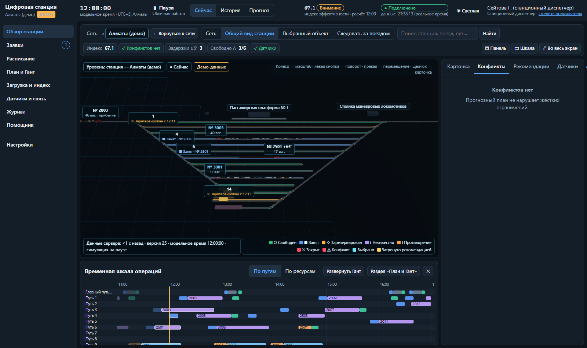
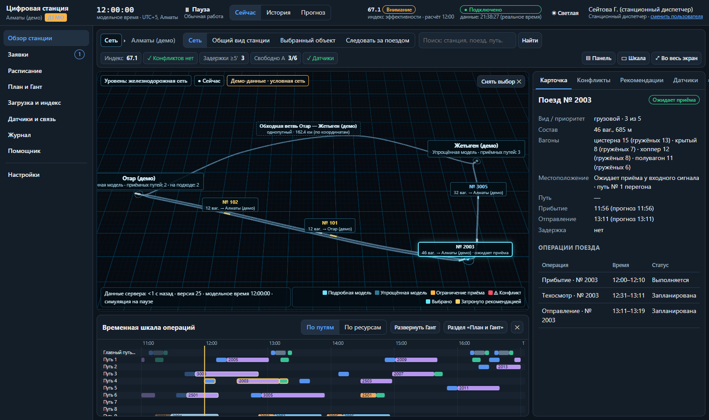
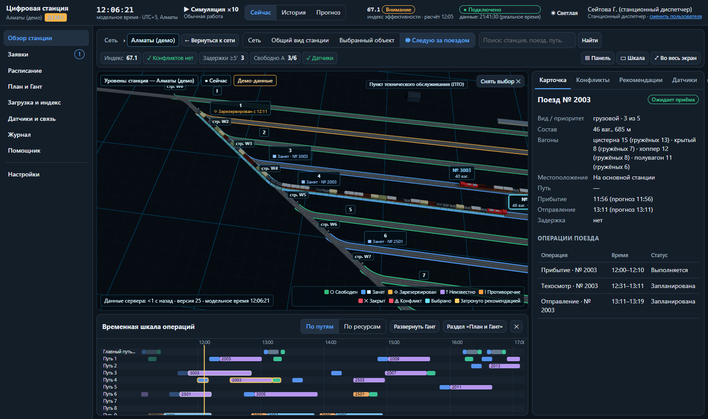

# 3D-цифровой двойник станций и сети

Главный экран «Обзор станции» — только 3D-сцена, без переключателя 2D/3D. Визуальный стиль взят из прототипа `3darchive.zip`: тёмная сцена `#050a10`, сетка, направленный и голубой заполняющий свет, циан-акцент выбора, подписи в рамках и плавная камера. Основа — Digital Nomads: архитектура, роли, серверные проверки, планировщик CP-SAT и телеметрия.

Из прототипа не перенесены два его недостатка:
- траектория поезда по отдельной кривой, не совпадающей с рельсами;
- пересчёт широты и долготы в сцену «как есть», без проекции.

## Компоновка экрана

| Зона | Содержимое |
|---|---|
| Верхняя панель | Уровень (`Сеть › Станция`) и «← Вернуться к сети». Режимы камеры. Поиск станции, перегона, поезда или пути. Краткие KPI. Кнопки «▤ Панель», «▭ Шкала» и «⤢ Во весь экран». |
| Центр | 3D-сцена. На ней: значки уровня и режима («Сейчас», «История», «Прогноз»), пометка «Демо-данные», возраст данных сервера, легенда. |
| Справа | Карточка выбранного объекта, конфликты, рекомендации, датчики. Панель сворачивается. |
| Снизу | Временная шкала операций по путям или ресурсам. «Развернуть Гант» показывает полную диаграмму. Шкала сворачивается. |

Состояние панелей запоминается в браузере. Остальные разделы (заявки, расписание, план и Гант, загрузка, датчики, журнал, помощник, настройки, администрирование) не изменились.

## Два уровня

### «Железнодорожная сеть»

- **Станции.** Основная станция — «Подробная модель». Она изображена в миниатюре по своей настоящей схеме путей: та же геометрия, переведённая в метры и повёрнутая по оси станции. Соседние станции — «Упрощённая модель». Для них показаны только данные, которые есть: число приёмных путей, допустимая длина поезда, время обработки, локомотивы, ограничения. Схема путей соседей не придумывается.
- **Перегоны.** Каждый путь перегона — отдельная линия со своим идентификатором (`SEC-…/1`, `SEC-…/2`). Число путей задаётся данными: однопутный перегон не получает второй путь. Пути двухпутного перегона плавно сходятся к горловинам станций.
- **Поезда на перегоне** — условный символ дальнего масштаба. В подписи — номер, фактическое число вагонов и направление.
- **Действия.** Щелчок по станции открывает её карточку. «Открыть станцию» плавно приближает камеру и переводит на уровень «Станция». Это работает только для основной станции; у соседних кнопка недоступна и объясняет почему.

### «Станция»

- **Пути** физические: балласт, две нитки рельсов по колее 1520 мм, шпалы, упоры в тупиках.
- **Стрелочные переводы** — дуги радиуса R: маршрут из любых рёбер гладкий, без изломов. У каждой стрелки есть привод с индикатором: в маршруте, неисправна, нет данных.
- **Сооружения** строятся только по зонам конфигурации: платформа и вокзал, грузовой фронт с краном, депо над тупиком, пост осмотра, стоянка локомотивов. Также показаны датчики и подходы к перегонам за входными горловинами с подписью «→ Жетыген, однопутный перегон, 50 км».
- **Топология берётся из конфигурации.** У малой станции (`small`) нет сортировочного парка и депо — их нет и на сцене.

Выбор объекта — только просмотр. Он не сбрасывает состояние станции, не двигает камеру и не требует прав администратора. «Снять выбор» тоже ничего не меняет.

## Единая геометрия

Рельсы, подсветка маршрута, локомотив и каждый вагон строятся по одной ломаной от backend. Используются одни идентификаторы и пройденное расстояние вдоль пути.

Величины разделены на три вида:

| Величина | Где | Единицы |
|---|---|---|
| Физическая длина | `length_m`, `useful_length_m` путей и рёбер, `length_m` перегона | метры |
| Координаты схемы станции | `points` путей и рёбер, `/topology` | единицы схемы (u) |
| Масштаб станции | `geometry.schema_scale_u_per_m` | u/м |
| Координаты сети | `centerline`, `tracks[].points` в `/network` | метры ENU |

- **Масштаб станции общий.** Прямая часть двустороннего пути вмещает его полезную длину. Изображение состава = фактическая длина × масштаб. Длина состава не подгоняется под путь.
- **Поперечные размеры** (колея, балласт, ширина и высота вагонов) увеличены в 2,2 раза для читаемости. Они не участвуют ни в одном расчёте.
- **Длина линии перегона на карте** — отдельная величина `geometry_length_m`. Положение поезда на перегоне задаётся долей пути (0…1) по геометрии того же пути, по которому нарисованы рельсы.

## Подвижной состав

Модели процедурные, без внешних файлов:
- локомотив с кабиной, окнами, капотом, полосой и прожектором;
- пассажирский вагон с окнами и дверями;
- полувагон (гружёный — с грузом), цистерна с колпаком, крытый вагон с дверью, платформа (гружёная — с контейнерами), хоппер.

У каждого вагона две тележки, у каждой тележки две колёсные пары, между вагонами — зазор сцепки.

Состав (`trains[].consist`) приходит с сервера группами однотипных вагонов в порядке от локомотива. Клиент не меняет ни число вагонов, ни их длины. Каждый вагон ставится по двум точкам тележек на ломаной, поэтому состав изгибается на кривых и в стрелочных переводах. Направление движения задаётся направлением ломаной, так что поддерживаются оба направления. Вагоны не «слипаются»: их сумма равна длине изображения состава.

**Положение поезда определяет сервер.** Клиент только интерполирует голову вдоль той же ломаной:
- не дальше границы операции (`head_end`, `frac_max`);
- не больше чем на 5 секунд реального времени;
- только в режиме «Сейчас» при работающей симуляции.

**При потере связи** интерполяция останавливается. На сцене появляется надпись «Связь с сервером потеряна. Показано состояние на ЧЧ:ММ:СС (получено N с назад). Движение составов остановлено».

## Поезд между станциями

Последовательность для одного и того же идентификатора поезда: станция отправления → перегон → ожидание у входного сигнала → приём на станцию → отправление → перегон → станция назначения.

Поезд никогда не находится в двух местах сразу. Пока у него есть положение на основной станции (`pos` без признака ожидания), его фаза в сети — «На основной станции». Это проверяет тест `test_train_is_never_on_section_and_station_at_once`.

## Статусы

Каждый статус показан цветом и текстом или значком: ○ Свободен, ■ Занят, ◇ Зарезервирован, ? Неизвестно, ! Противоречие, ✕ Закрыт, ⚠ Конфликт (пульсирующая подсветка пути).

«Зарезервирован» — это свободный путь, у которого серверный резерв начинается в ближайшие 30 модельных минут. Клиент только отображает серверные данные.

Подсветка рекомендации — жёлтая, выбранный объект — циан.

## Камера

Четыре режима, все включаются явно:

| Режим | Что делает |
|---|---|
| «Сеть» | Общий вид сети. |
| «Общий вид станции» | Общий вид основной станции. |
| «Выбранный объект» | Однократный перелёт к выбранному объекту. |
| «Следовать за поездом» | Включается и выключается той же кнопкой. Ракурс пользователя сохраняется. |

Перелёт плавный, как в 3darchive: сглаживание 1 − e^(−k·dt). Ручное вращение прерывает перелёт.

## Подписи

Подписи — DOM-слой поверх canvas. Каждый кадр якоря проецируются в экран. Несколько раз в секунду подписи раскладываются по приоритету без наложений, видно не больше 46 одновременно.

Порядок приоритета: выбранное → конфликты → движущиеся составы → прочее. Мелкие подписи (стрелки) видны только вблизи.

## Рекомендации

Рекомендации рассчитывает сервер (детектор конфликтов и CP-SAT), случайных или выдуманных советов нет. Кнопка «Показать на схеме» подсвечивает затронутые поезда и пути и переводит камеру к первому из них. Затронутые объекты — это `affected[].id` и `changes[].train_id/track_ids`.

Перед применением видны:
- последствия: конфликты, задержка, индекс до и после;
- время расчёта и версия состояния.

При применении действуют все прежние серверные проверки: права, повторная проверка, запрет двойного резерва, отказ для устаревшей версии. Недоступные кнопки объясняют причину.

## Режимы «Сейчас», «История», «Прогноз»

- **«История».** Кадр состояния из журнала дельт показывается тем же редьюсером. Камера не сбрасывается, команды недоступны.
- **«Прогноз».** Составы стоят на путях по прогнозному плану на выбранный момент, подписи помечены «прогноз». Статусы путей тоже прогнозные («Занят по прогнозу»), а не текущие наблюдения.

## Производительность

- Шпалы — один `InstancedMesh`. Кузова — по одному `InstancedMesh` на вид вагона. Тележки и колёсные пары — свои `InstancedMesh`. Балласт и рельсы всей станции — по одной геометрии.
- **LOD:** тележки видны ближе 1300 единиц, колёсные пары — ближе 650. Дальше остаются только кузова, без изменения числа вагонов.
- Геометрия строится один раз на топологию и освобождается при её смене (`dispose`).
- Дельты состояния меняют только матрицы экземпляров, сцена целиком не перестраивается.
- Уровень «Станция» строится лениво. 3D-модуль загружается отдельным чанком.

## Состояния и отказы

- **Загрузка** — индикатор для схемы станции и модели сети.
- **Сеть недоступна** — сообщение и переход к станции.
- **Нет WebGL** — сообщение, ссылки на табличные разделы и таблица состояния путей.
- **Потеря контекста WebGL** — сообщение с советом обновить страницу.
- **Защита от поздних ответов.** При смене станции или сценария ответ `/topology` или `/network` для прежней станции не применяется: проверяются флаг актуальности и идентификатор станции.

## Код

- `frontend/src/twin/`:
  - `geometry.ts` — расстановка вагонов, интерполяция, подписи;
  - `models.ts` — процедурные модели, рельсы и балласт;
  - `StationLevel.tsx`, `TrainsLayer.tsx`, `NetworkLevel.tsx`, `CameraRig.tsx`, `labels.tsx`, `Cards.tsx`, `TwinScene.tsx`.
- `backend/app/domain/topology.py` — плавные стрелочные переводы и масштаб.
- `backend/app/domain/network.py` — сеть, проекция, перегоны.
- `backend/app/services/view.py::network_view` — фазы поездов в сети.

Формат импорта реальных данных — [network-import.md](network-import.md).
